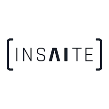

## Keep
- *Full Stack Developer* | Jul'23 - Mar'24
- 
- Tags: Keep
- Badges:
  - Node.js [green]
  - Next.js [white]
  - GraphQL [purple]
- List Items:
  - Engineered and managed the accounting integration system leveraging Rutter, streamlining financial data processes and enhancing accuracaccuracy.
  - Created an automated pre-screening procedure to verify user data integrity, incorporating Intelligent Character Recognition (ICR) technology with Trulioo for seamless validation.
  - Expanded functionality of the existing application by integrating two additional roles, defining permissions and addressing edge cases, thus enhancing overall usability and security.

## Sngular
- *Sr. Full Stack Developer*  | Apr'21 - Jun'23
- 
- Tags: Sngular
- Badges:
  - Node.js [green]
  - Golang [cyan]
  - Microservices [red]
  - React [blue]
  - AWS [orange]
- List Items:
  - Developed the CashConsolidator App utilizing React and a robust Node.js Microservices architecture, seamlessly integrating Plaid for  functionality.
  - Enhanced the Customer Support System infrastructure by seamlessly integrating AWS services such as SES and SNS, ensuring streamlined communication and support processes.
  - Played a pivotal role as a mentor, guiding junior team members through hands-on mentorship and facilitating targeted training sessions to elevate the collective skill set of the team.

## Insaite.io
- *Full Stack Developer*  | Mar'20 - Mar'21
- 
- Tags: Insaite.io
- Badges:
  - Node.js [green]
  - Python [yellow]
  - Golang [cyan]
  - React [blue]
  - GraphQL [purple]
- List Items:
  - Orchestrated seamless integration of AI models into various industry applications, employing serverless and microservices architectures.
  - Architected and implemented serverless architecture for efficient web scraping operations using Puppeteer.
  - Engineered a browser extension integrating Facebook API and AI models, facilitating targeted marketing strategies.
  - Executed successful migration of AWS Lambda services to Azure Functions, ensuring continuity and efficiency in cloud operations.

## Cuentame
- *Full Stack Developer*  | Nov'18 - Mar'20
- 
- Tags: Cuentame
- Badges:
  - Node.js [green]
  - Angular2+ [red]
  - PL/SQL [teal]
- List Items:
  - Spearheaded the creation of Nom-035 testing system utilizing REST services with Node.js backend and Angular frontend.
  - Contributed to the enhancement and maintenance of features on an online video therapy platform, leveraging PL/SQL and Angular, including integration with Twich SDK.
  - Established a robust mental health content management system utilizing Angular for frontend and Node.js for backend functionality.