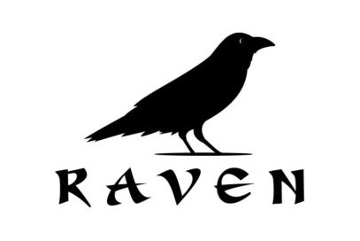
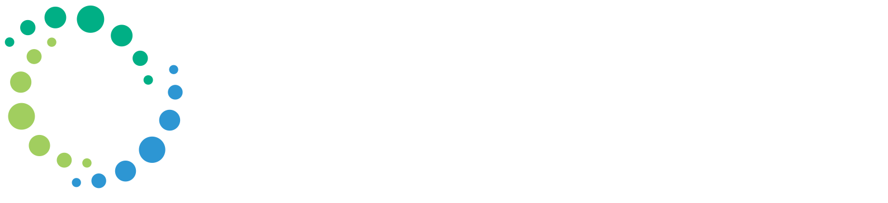
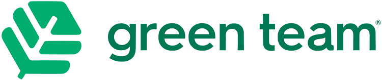
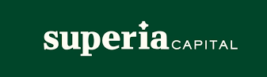

## Raven Simulator
Stock trading simulator using real data from the Mexican stock exchange. Powered by AI, it analyzes stock charts and provides trading recommendations through Reinforcement Learning. Perfect for honing investment strategies in a risk-free environment.
- 
- Tags: Raven
- Badges:
  - Own Project [white]
  - Node.js [green]
  - Angular2+ [red]
  - AWS [orange]
- Buttons:
  - Video Demo [https://www.youtube.com/watch?v=eKG4Hdqtgbo]

## Neology
Crafted the primary website for Neology, a top-tier provider of OCR technology based in the UK. This dynamic platform offers multi-language support, mobile-friendly design, and engaging content, ensuring an immersive experience for visitors.
- 
- Tags: Neology
- Badges:
  - Freelance [white]
  - React [blue]
  - Redux [gray]
- Buttons:
  - Link [https://neology.com/]

## Green Team Mexico
Successfully migrated the e-commerce platform for Green Team, a Mexican company dedicated to promoting environmentally friendly substitutes. Our upgrade includes support for queue contact notifications and mobile-friendly features, ensuring seamless and accessible shopping experiences consumers.
- 
- Tags: GreenTeam
- Badges:
  - Freelance [white]
  - Golang [cyan]
  - GraphQL [purple]
  - Angular2+ [red]
- Buttons:
  - Link [https://greenteammx.com/]

## Superia
Banking software tailored for reviewing and managing loan processes for businesses. Streamlining the loan application and approval journey, ensuring efficient and accurate decision-making.
- 
- Tags: Superia
- Badges:
  - Freelance [white]
  - Node.js [green]
  - GraphQL [purple]
  - React [blue]
- Buttons:
  - Link [https://superiacapital.com]
